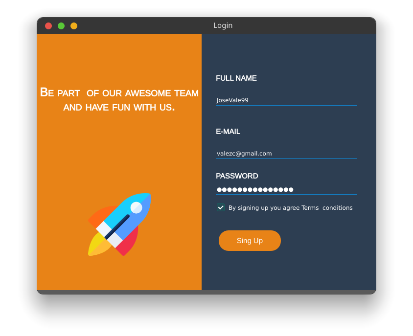

# Vista de registro en PyQT5
Vista de login en python con la librería PyQT5

## Configuración

 1. De esta manera convertimos archivos `.ui` a `py`:
 ```bash
    $ pyuic5 -x login.ui -o login.py 
 ```

 2. Correr el archivo `main.py`


## Dependencias
1. PyQT5
    - pip install PyQt5


## Vista previa

